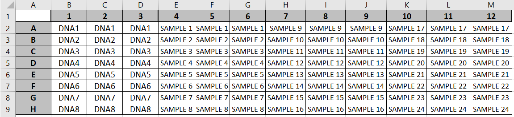

# Picogreen DNA Quantification Analysis Automation
#### [By Joon Hwan Hong](https://github.com/Joon-Hwan-Hong "My Github Page!")

## Introduction
Picogreen DNA quantification protocol is a method to quantify DNA in samples. DNA samples were obtained from post-mortem human brain tissue at the Douglas Mental Health University Institute. Samples were diluted and placed into 96-well plates, which was quantified in the TECAN Spark reader using a modified PicoGreen protocol.

I made this repository as it was annoying to do it by hand every time on excel. Saves time and why not make it as a personal project in using pandas and excel manipulations. The notebook accounts for the plate layout including triple copy of the Standard DNA curve and the DNA sample slots. (3 wells per sample/DNA curve). Currently the notebook requires that the plate layout file and the results sheet to be on the same directory, will be improved later.

Some excel data is included in repository (/Sample Data), however all irrelevant information in them was removed for potential privacy concerns.

## How to use (GUI method):
1. Download/clone project and Run \\GUI\\src\\Main.java
> Example of how to use
> 
2. Click ***1. Select files and Generate Report***. Select the experimental data sheet from the TECAN Spark reader first, then select the protocol plate layout.
> Example of plate layout is shown below and on the repository. Position of standard DNA curve chosen arbitrarily. The names on cells can be customized to the experimenter's choice for the report generation.
> 
3. Then click generate report, wait a few seconds for the report to be generated, then click ***2. Select and Open .xlsx*** to open up the generated report.

## How to use (.ipynb method \[not maintained\]):
1. Put the jupyter notebook and two separate excel files (one generated from TECAN Spark reader for Picogreen and the protocol plate layout) into the same directory/ folder.
> Example of plate layout is shown below and on the repository. Position of standard DNA curve chosen arbitrarily. The names on cells can be customized to the experimenter's choice for the report generation.
> 
2. Go to <<Misc. and Settings>> to change parameters (need to change the name of layout and tecan excel file) 
3. Click "Cell" on the Menu bar, then click "Run All"
4. The report should be generated in the same directory / folder

### Function & Development Plan
The notebook achieves the following:
1. Display plate layout and the individual quantification recordings of each 96 well slots 
2. Determine the average value for each DNA sample
3. Determine the concentration for each DNA sample
4. Visualize the data obtained
5. Create a new summarized excel sheet containing all the data
6. Develop a GUI for easier use (CURRENT DEVELOPMENT)
7. Detect extreme/ "odd recordings" and exclude from calculations (TBD)

If there are any questions on the code, feel free to [email me](mailto:joon.hong@mail.mcgill.ca)
